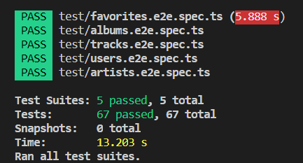
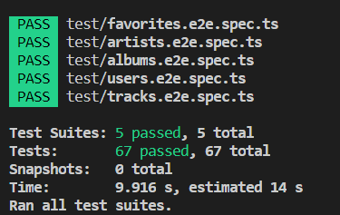

# Home Library Service

## Prerequisites

- Git - [Download & Install Git](https://git-scm.com/downloads).
- Node.js - [Download & Install Node.js](https://nodejs.org/en/download/) and the npm package manager.

## Downloading

```
git clone {repository URL}
```

## Getting started

```
1. npm install (admin rights may be needed)
2. Create .env file (based on .env.example): ./.env
3. Apply pending migrations: npx prisma migrate deploy
4. Generate Prisma Client: npx prisma generate

P.S. In the created .env file there is a DATABASE_URL=file:memory string (see https://www.sqlite.org/inmemorydb.html).
     The DATABASE_URL parameter value is used by SQLite.
     According to the task, the database should be stored IN MEMORY.
```

## Running application

```
npm run start
```

After starting the app on port (4000 as default) you can open in your browser OpenAPI documentation by typing http://localhost:4000/doc/. For more information about OpenAPI/Swagger please visit https://swagger.io/.

## Testing

After application running open new terminal and enter:

To run all tests without authorization

```
npm run test
```




To run only one of all test suites

```
npm run test -- <path to suite>
```

### Auto-fix and format

```
npm run lint
```

```
npm run format
```

### Debugging in VSCode

Press <kbd>F5</kbd> to debug.

For more information, visit: https://code.visualstudio.com/docs/editor/debugging
