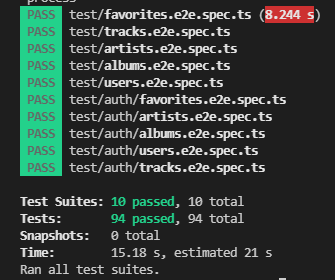
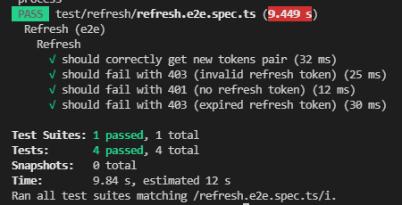

# Home Library Service

## Prerequisites

- Git - [Download & Install Git](https://git-scm.com/downloads).
- Node.js - [Download & Install Node.js](https://nodejs.org/en/download/) and the npm package manager.
- Download and install Docker and Docker Compose (only for running PostgreSQL if you do not have PostgreSQL installed in your system).

## Downloading

```
1. application:
git clone https://github.com/natallia-js/nodejs2024Q3-service.git

2. my database docker image (if necessary):
docker [image] pull natalliaf/nodejs2024q3-service-postgresdb:latest
```

## Getting started

1. Switch to the necessary branch:

```
git checkout auth_and_logging
```

2. 

```
npm install
```

3. Create .env file based on .env.example: ./.env

Modify environment variables in .env file as needed.

Specifying ports, make sure there are no port conflicts in your system.

LOG_LEVEL environment variable can be one of: verbose, debug, log, warn, error.
Assuming that:

  verbose - the lowest log level, enable detailed trace logging mainly for application troubleshooting

  debug - used for application debugging purposes and to inspect run-time outcomes in development environments

  log - used for application monitoring and to track request and response details or specific operation results

  warn - used to review potential non-critical, non-friendly operation outcomes

  error - the most helpful, and yet the most unwanted, log level;
          enables detailed error tracking and helps to write error-free applications

MAX_LOG_FILES_COUNT environment variable means that maximum number of log files of a definite log-level will be MAX_LOG_FILES_COUNT or MAX_LOG_FILES_COUNT + 1.

## Running application

Two ways to run the application are possible:

1. To run in development mode:

```
npm run start:prisma:dev
```

To run in production mode:

```
npm run build

npm run start:prod
```

2. Use Docker Compose to run the application:

```
npm run docker:up:build
```

or

```
npm run docker:up
```

The first command builds Docker images and starts database and app services defined in docker-compose.yml file. 

The second command just starts services, without building them.

In both cases application is started in development mode and automatically rebuilds on changes made in source code.

## After running the application

After starting the app on port (4000 as default) you can access it in your browser (http://localhost:4000) and open in your browser OpenAPI documentation by typing http://localhost:4000/doc/.

## How to stop running containers

1. To stop containers without their deletion:

```
npm run docker:stop
```

2. To stop containers, remove them and all volumes and networks that were created by `npm run docker` command:

```
npm run docker:down
```

To remove all the mentioned above including volumes:

```
npm run docker:down:volumes
```
## Testing

Run the application [in container]. After application running open new terminal and enter:

```
npm run test:auth
```

and

```
npm run test:refresh
```

to run all test with authorization.





To run only one of all test suites

```
npm run test -- <path to suite>
```

### Auto-fix and format

```
npm run lint
```

```
npm run format
```

### Debugging in VSCode

Press <kbd>F5</kbd> to debug.

For more information, visit: https://code.visualstudio.com/docs/editor/debugging
